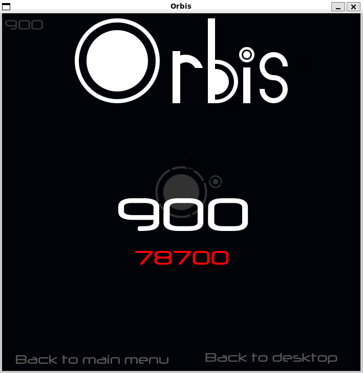

# Orbis
<p align="center">
  
</p>

This is an old hobby game project from 2014, written in C++11 using SFML 2.1. Originally developed as a learning exercise and personal project, it has been updated with modern Linux build tools to make it compilable on current systems.

## Dependencies

- C++11 compatible compiler (g++ 4.8+)
- SFML 2.1+ (Simple and Fast Multimedia Library)
- Make

## Building

### Option 1: Native Build

Install dependencies on Ubuntu/Debian:
```bash
sudo apt-get update
sudo apt-get install build-essential libsfml-dev
```

Build the project:
```bash
./build.sh native
# or simply
make release
```

Run the game:
```bash
./orbis-game
```

### Option 2: Docker Build

If you have Docker installed:
```bash
./build.sh docker
```

Run with Docker:
```bash
./run-docker.sh
```

## Build Targets

- `make release` - Build optimized release version
- `make debug` - Build debug version with symbols
- `make clean` - Clean all build artifacts
- `make run` - Build and run the release version

## Project Structure

- `Orbis/` - Main game source files
- `st4code/` - State management framework
- `data/` - Game assets (images, fonts, etc.)
- `release/` - Release build output
- `debug/` - Debug build output

## Notes

- This is a hobby project from 2014, preserved for historical/educational purposes
- The game requires X11 display for GUI
- Original project used SFML 2.1, but should work with newer versions  
- The project was originally built with MinGW on Windows, now adapted for Linux
- Code may not follow modern C++ best practices as it was a learning project